# Instrumenting AI/LLM Chatbots with Observability using TrueWatch, Dify, and Ollama
*(Hands-on demo for TrueWatch users & partners)*

---

This guide helps you instrument your AI/LLM chatbot (built on the Dify platform with Ollama LLM) with observability using TrueWatch and DataKit.

## Prerequisites

- Machine (e.g., **Ubuntu 24.04**) with at least **10 GB RAM** and **2 vCPUs**.  
- Create an account at [TrueWatch](https://id1-auth.truewatch.com/businessRegister).  
- Create a workspace in TrueWatch and obtain your workspace token:  
  - Log in to TrueWatch, select your workspace, and copy your workspace token (`ENV_DATAWAY`).

## Step 1: Install Docker and Docker Compose

```bash
sudo apt update
sudo apt install docker.io docker-compose -y
sudo systemctl start docker
sudo systemctl enable docker
```

## Step 2: Clone and Set up Dify Platform

```bash
git clone https://github.com/langgenius/dify.git
cd dify/docker
```

## Step 3: Integrate TrueWatch Observability and DataKit

Clone the TrueWatch Git repository containing necessary configuration files:

```bash
git clone https://github.com/TrueWatchTech/llm-observability-demo-setup-guide.git
```

Copy and overwrite the necessary configuration files from the cloned TrueWatch repo to the Dify Docker folder:

```bash
cp -R llm-observability-demo-setup-guide/resources/datakit-config ./
cp llm-observability-demo-setup-guide/resources/docker-compose.yaml ./
cp llm-observability-demo-setup-guide/resources/Dockerfile.proxy ./
cp llm-observability-demo-setup-guide/resources/app.py ./
```

Ensure your `docker-compose.yaml` includes your correct workspace token under the datakit service (line 564):

```yaml
environment:
  ENV_DATAWAY: "https://<your_truewatch_region>-openway.truewatch.com?token=<your_workspace_token>"
```

## Step 4: Deploy and Run Containers

```bash
docker compose up -d
```

## Step 5: Access and Configure Dify

1. Open your browser and navigate to: `http://localhost`. Furnish the details and create an account. 

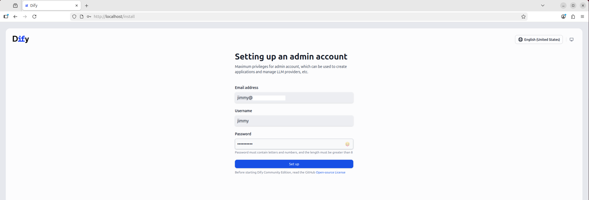

2. Create an app workspace.

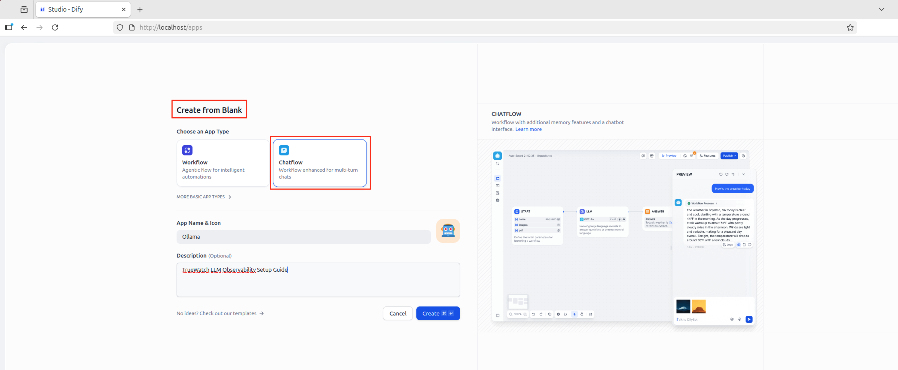

3. Configure model provider

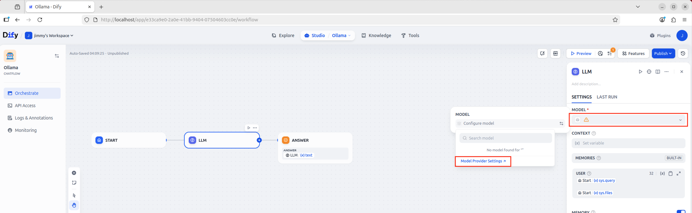

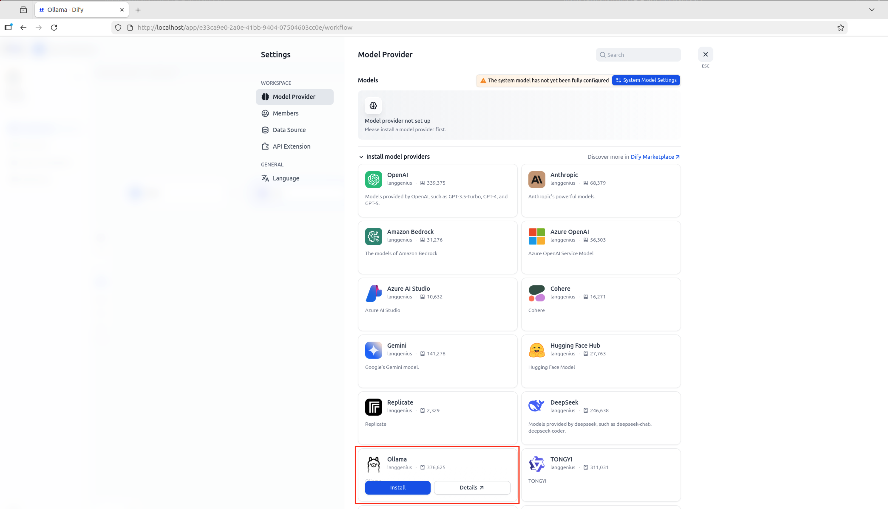

4. Set up your LLM (Ollama):  
   - Navigate to **Models** → **Add Model**.  
   - Configure your Ollama model URL (e.g., `http://ollama:11434`). Use default settings for the rest of the fields.

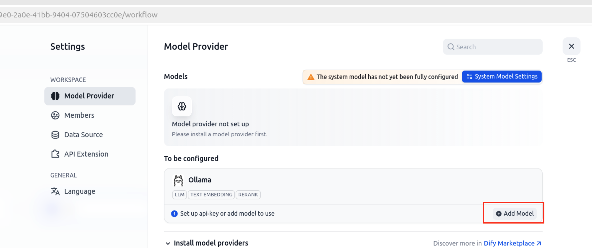

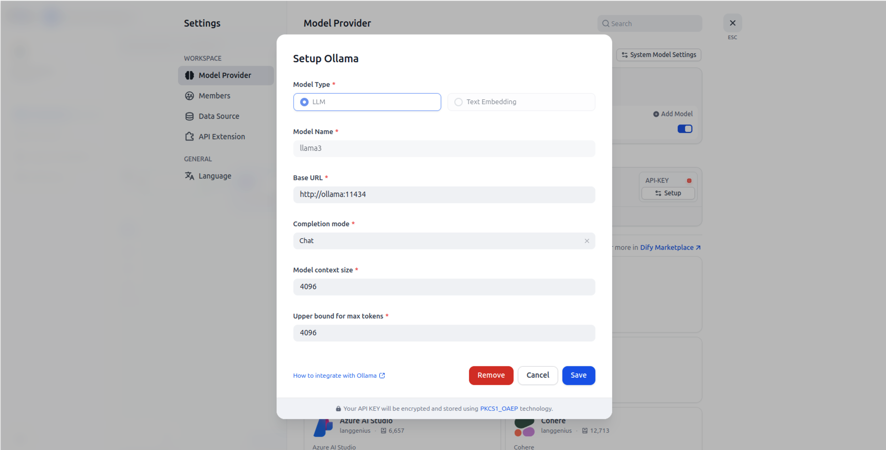

## Step 6: Deploy the Proxy (`app.py`)

`app.py` acts as a proxy and is invoked via the `Dockerfile.proxy` file. Ensure the `app.py` and `Dockerfile.proxy` are correctly placed in your docker‑compose setup as shown in Step 3.

> **Note:** If you make changes to `app.py`, you do **not** have to redeploy all services; just redeploy the proxy service as shown in the Troubleshooting section below.

## Step 7: Preview and Interact with the Bot

- In the Dify workspace, select your chatbot and click **Preview**.  
- Interact with the chatbot to generate traces and data for TrueWatch observability.

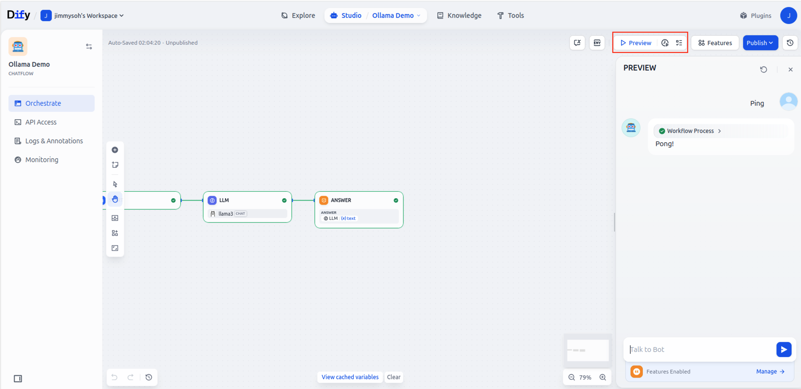

## Step 8: View Observability Data in TrueWatch

1. Log in to your TrueWatch account.  
2. Navigate to **APM** → **Traces**.  
3. Filter services by `ollama-proxy` to view detailed traces and spans, including token usage and costs.

## Step 9: Explore APM Traces (placeholders for screenshots)

Follow the numbered callouts in the screenshot below to understand each section of a trace:

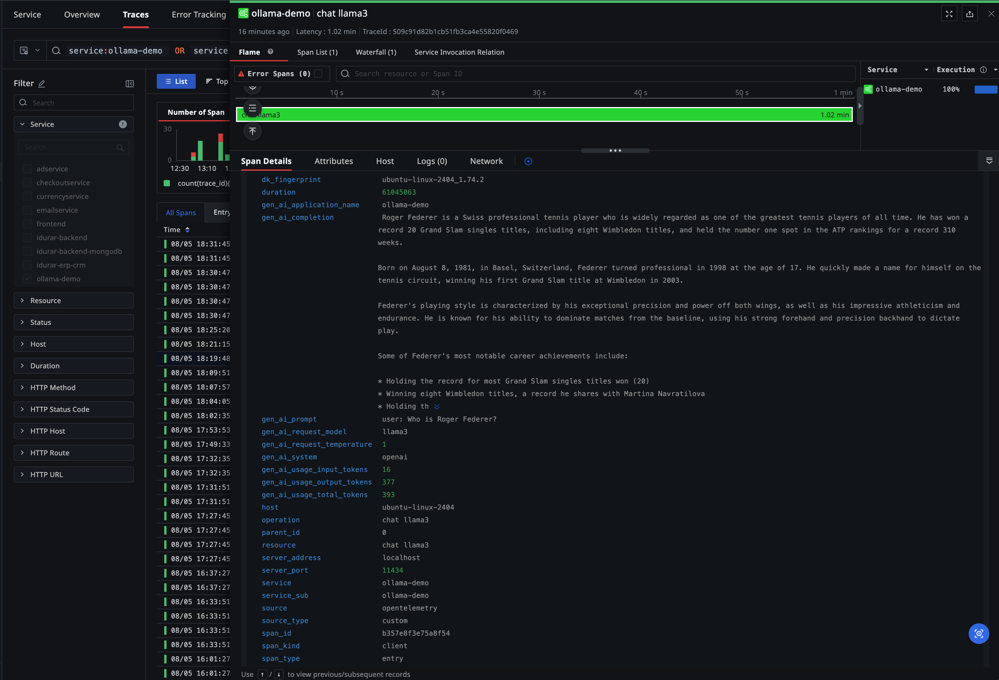

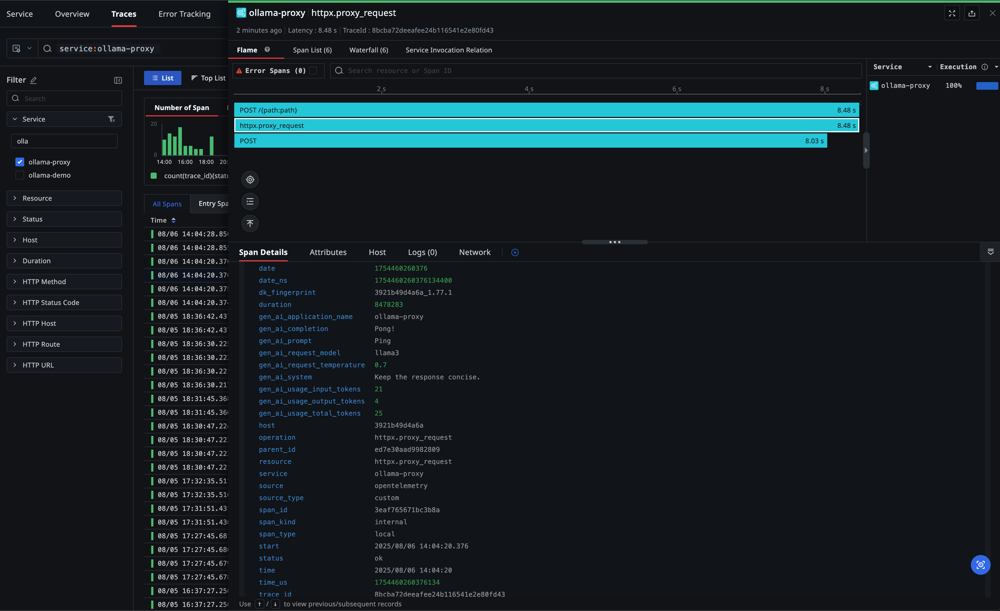

## Step 10: Use the Pre‑built LLM Observability Dashboard

TrueWatch ships with a ready‑made dashboard that aggregates key LLM usage metrics (token counts, usage over time, etc.)

1. Go to **Dashboards** → **Create** → **System Views** → **OpenLIT Monitor View**.
2. Furnish the fields to create your OpenLIT Monitor View dashboard.  
2. Select the time range that matches your chatbot’s activity.  
3. Hover over any panel for tooltips and click a chart to drill into traces behind a spike.

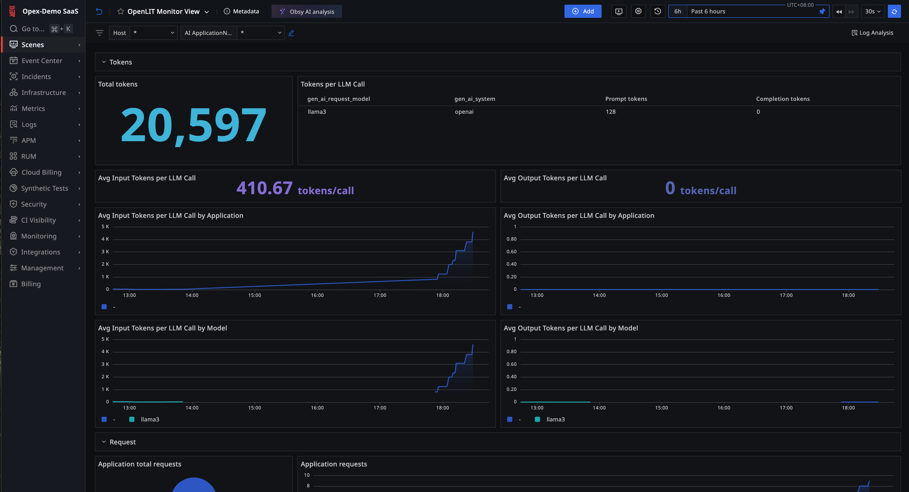

### Import Custom Dashboard

You may also import a pre-built custom dashboard that includes more metrics such as success/error rates, call response times, etc.

1. Go to **Dashboards** → **Import Dashboard** → **Open** ``` llm-observability-demo-setup-guide/resources/LLM Observability (OpenLIT) Dashboard.json ```.
2. Import Pipeline Script via **Management** → **Pipelines** → **Import** ``` llm-observability-demo-setup-guide/resources/Pipelines Template.json ```.

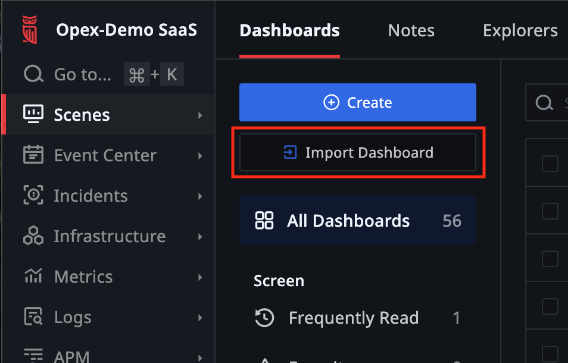

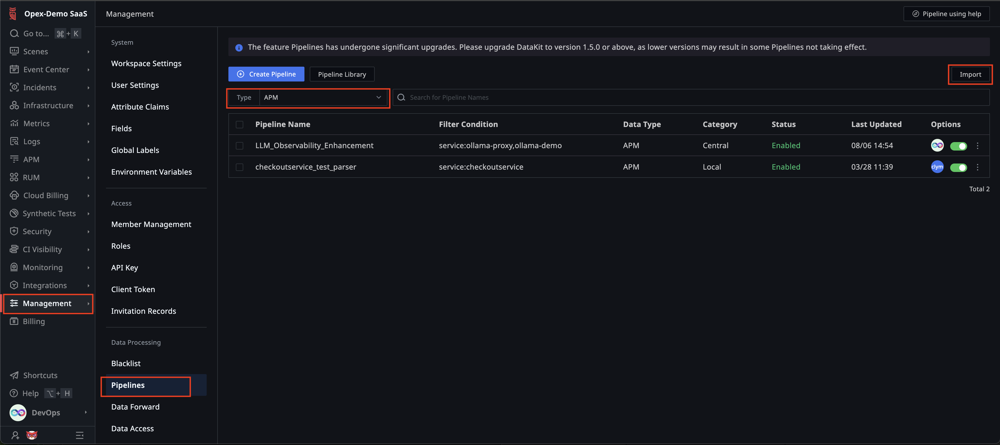

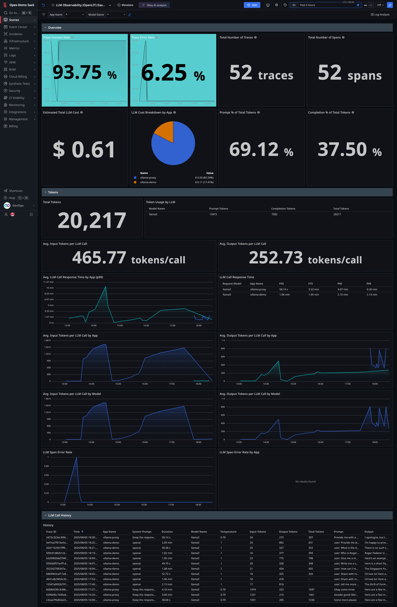

## Troubleshooting and Validation

### Redeploy Only the Ollama Proxy (after `app.py` updates)

```bash
docker compose up -d --build ollama
```

### Llama3 Model Not Installed in real-ollama

```bash
docker exec -it real-ollama ollama pull llama3
docker exec -it real-ollama ollama list
```

### Check Connectivity to Ollama Service

```bash
docker exec -it docker-api-1 bash
curl -v http://ollama:11434/v1/models
curl -v http://ollama:11434/v1/chat/completions   -H "Content-Type: application/json"   -d '{"model":"llama3","messages":[{"role":"user","content":"ping"}]}'
```

### Check Ollama Logs for Errors

```bash
docker compose logs --tail=50 ollama
```

### Ensure *no* Host‑side Ollama or DataKit Services Are Running

Host‑installed versions can occupy the same ports (11434 for Ollama, 9529/4317/4318 for DataKit) and block the containers.

```bash
# --- Ollama ------------------------------------------------------
sudo lsof -i :11434        # native process
sudo systemctl stop ollama
sudo systemctl disable ollama
sudo lsof -i :11434        # should return nothing

# --- DataKit -----------------------------------------------------
sudo lsof -i :9529         # DataKit UI
sudo lsof -i :4317         # OTLP gRPC
sudo lsof -i :4318         # OTLP HTTP
sudo systemctl stop datakit
sudo systemctl disable datakit
sudo lsof -i :9529 :4317 :4318
```

### Managing Docker Compose

| Action               | Command                        |
|----------------------|--------------------------------|
| Bring down containers| `docker-compose down`          |
| Restart stack        | `docker-compose up -d`         |
| Check status         | `docker-compose ps`            |
| Tail DataKit logs    | `docker logs --tail=50 datakit` |

## Next Steps

- Customize observability dashboards in TrueWatch.  
- Integrate additional instrumentation such as logs and metrics.

## References

- [TrueWatch Documentation](https://docs.truewatch.com)  
- [Dify Platform Documentation](https://docs.dify.ai)  
- [Ollama Documentation](https://github.com/ollama/ollama)
